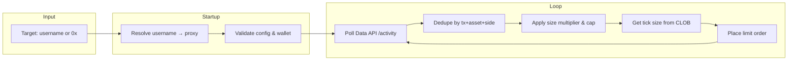
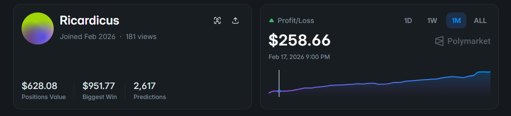
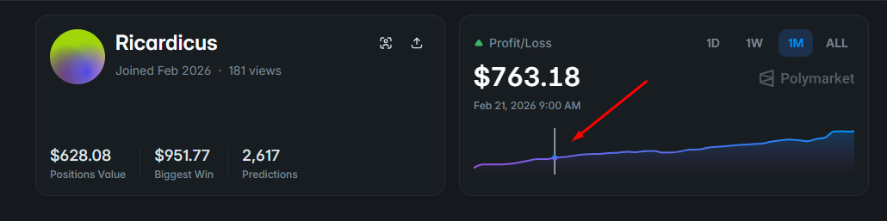
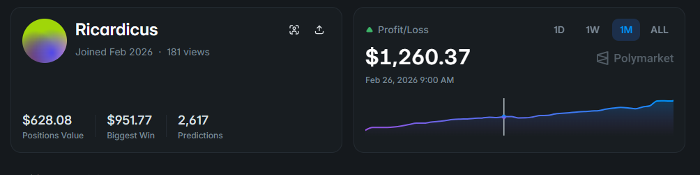
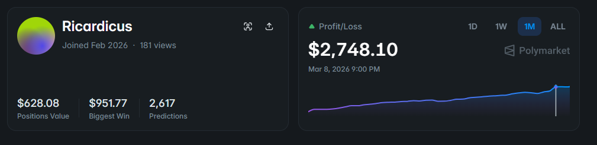

# polymarket copy trading bot

A TypeScript bot that mirrors a chosen trader’s public Polymarket activity on your account: it discovers their trades via the Data API and places limit orders on the same markets with configurable size. Built for clarity and maintainability.

## Workflow

### History

| | |
|:---:|:---:|
|  |  |
|  |  |

---

## What It Does

You pick a **target** (by Polymarket username or proxy wallet). The bot periodically fetches that target’s recent **TRADE** activity, deduplicates it, then for each new trade it:

- Applies your size rules (multiplier and optional per-order cap)
- Fetches the market’s tick size from the CLOB
- Submits a **limit order** on your behalf (same side and price, adjusted size)

Settlement stays on-chain and non-custodial; the bot only signs orders through the Polymarket CLOB.

---

## Strategy

**Detection**  
Trades are discovered from Polymarket’s public **Data API** (`/activity?user=…&type=TRADE`). The bot polls at a fixed interval (e.g. every 15 seconds). Each trade is uniquely identified by transaction hash, asset, and side so the same fill is never copied twice.

**Execution**  
Orders are sent to the **CLOB** as Good-Till-Cancelled (GTC) limit orders at the same price as the copied trade. Size is derived from the target’s size using a multiplier and an optional maximum notional per order. Tick size is read from the order book so prices conform to the market’s rules.

**Target resolution**  
If you configure a Polymarket **username** (e.g. `alice`) instead of a 0x address, the bot resolves it once at startup by loading the profile page and reading the proxy address from the embedded data. After that, all polling uses the resolved proxy.

**Safety**  
- **Size controls**: `COPY_SIZE_MULTIPLIER` and `COPY_MAX_ORDER_USD` keep copied size within your chosen range.  
- **Trade-only**: only `TRADE` activity is copied; other activity types are ignored.

---

**High level:**

1. **Startup** — Resolve target (username → proxy if needed), validate environment and wallet/API settings.
2. **Poll** — Request the target’s recent activity (TRADE only, newest first).
3. **Dedupe** — Skip events already seen (in-memory set keyed by transaction hash, asset, side).
4. **Size** — Compute order size: `size × multiplier`, then cap by `COPY_MAX_ORDER_USD` if set.
5. **Order** — Fetch tick size for the token, then create and post a GTC limit order at the same price.

---

## Configuration

All behavior is driven by environment variables (see `.env.example`). Important groups:

| Purpose | Variables |
|--------|-----------|
| **Target** | `COPY_TARGET_USER` (username) or `COPY_TARGET_PROXY` (0x). One required. |
| **Copy behavior** | `COPY_POLL_INTERVAL_MS`, `COPY_ACTIVITY_LIMIT`, `COPY_SIZE_MULTIPLIER`, `COPY_MAX_ORDER_USD`, `COPY_TRADES_ONLY`, `COPY_DRY_RUN`. |
| **Wallet & API** | `POLYMARKET_PRIVATE_KEY`, `POLYMARKET_ADDRESS` (or `POLYMARKET_ADDRESS`). Optional: `POLYMARKET_API_KEY`, `POLYMARKET_API_SECRET`, `POLYMARKET_API_PASSPHRASE`; if omitted, the bot can derive API credentials. |

---

## Requirements

- A Polymarket account and a wallet that can sign for your proxy/funder address
- Target: Polymarket username or proxy wallet address (0x…)

---
